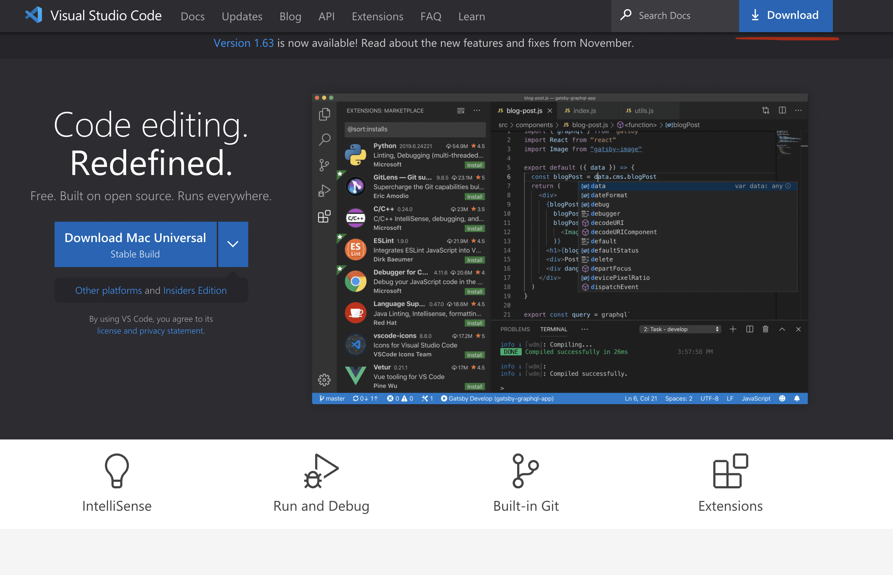
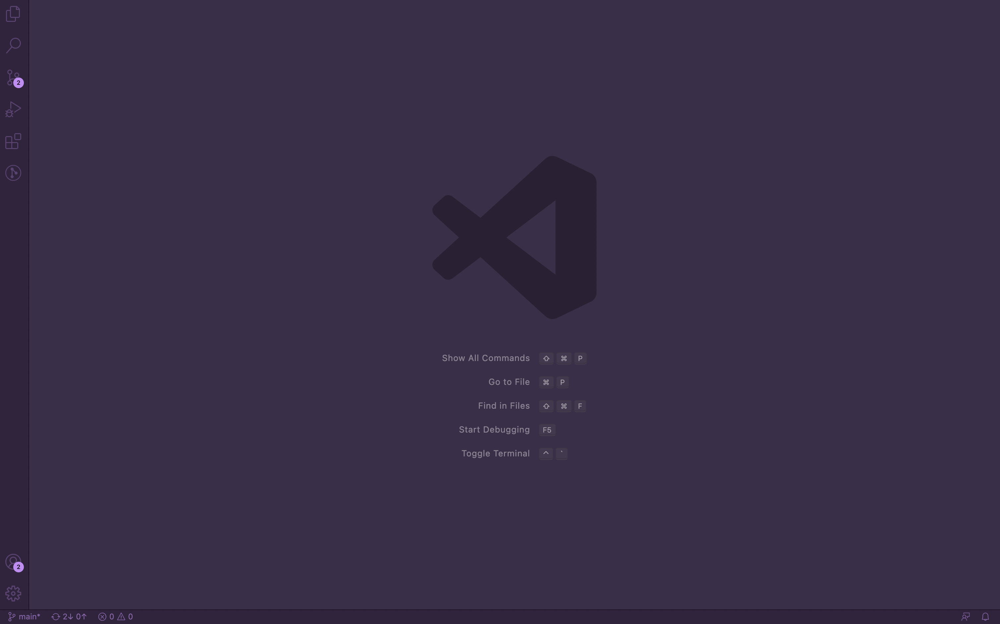
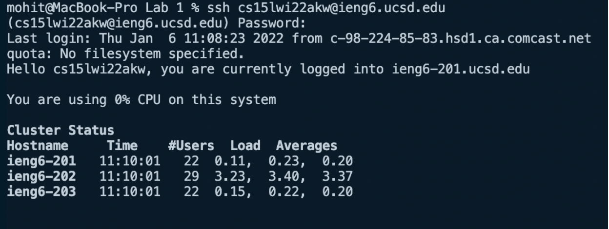
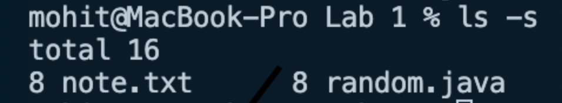
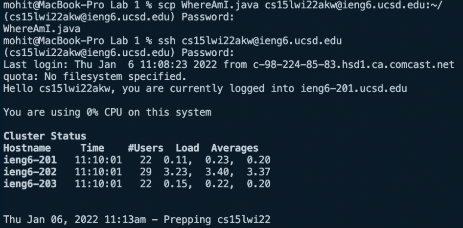
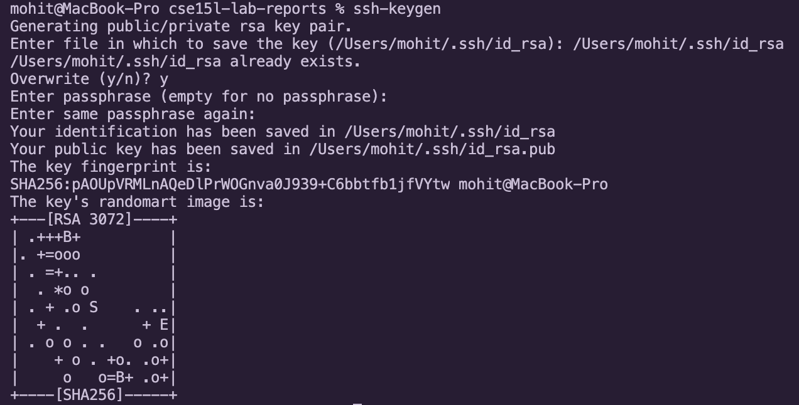
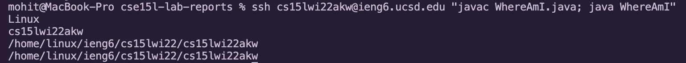

# Lab Report #1

## 1) Installing VSCode
* To begin installing VSCode, visit the website [here](https://code.visualstudio.com/) and follow the steps to download.

 

* Once you have downloaded VSCode correctly, the home page should look something like this:

* **Note:** Your home page may have a slightly different format or color (these can be modified later with certain extensions).

## 2) Remotely Connecting

* In order to conect to a remote computer, we need to first look-up the login information. To find your CSE 15L course-specific account, visit the website [here](https://sdacs.ucsd.edu/~icc/index.php). 

* If you are on Windows, before starting the following step, make sure to install [OpenSSH](https://www.openssh.com/). Enter the following command into the VSCode terminal to begin connecting (open the terminal by clicking Terminal > New Terminal):

  `$ ssh cs15lwi22xyz@ieng6.ucsd.edu`

  **Replace "xyz" with your course-specific username**

    `The authenticity of host 'ieng6.ucsd.edu (128.54.70.227) can't be established.
    RSA key fingerprint is SHA256:ksruYwhnYH+sySHnHAtLUHngrPEyZTDl/1x99wUQcec.
    Are you sure you want to continue connecting (yes/no/[fingerprint])?`

* If you are connecting for the first time, enter 'yes' for the above message. Then, enter your password and press enter. You should now be logged in. The terminal should display something like this: 

## 3) Trying Some Commands

* Try some of the following commands on your local computer and the remote UCSD computer:
    - `cd ~`
    - `cd`
    - `ls -lat`
    - `ls -s`
    - `ls <directory>`
    - `cp /home/linux/ieng6/cs15lwi22/public/hello.txt ~/`

* For example, here is what running the `ls -s` command looks like on a local computer: 

## 4) Moving Files with `scp`

* Now let's try copying a file from the local computer over to the remote computer. First, make a file on your computer called `Test.java` containing some code. Then, type the following command in the Terminal:

    `scp filename.java cs15lwi22zz@ieng6.ucsd.edu:~/`

* Enter your password, and the file should be copied to the remote computer! In order to verify this, login to your remote computer and type `ls`, which prints the files in the current directory. You should see `Test.java` there.

* Use the image below for reference:

## 5) Setting an SSH Key

* As you can tell, logging in every single time can become quite tedious. In order to facilitate this process, we can generate something called an SSH Key which will allow us to login with simply the `ssh` command without having to enter our password. 

* Enter `ssh-keygen` and follow the steps below to create the key:

* Now, we need to copy the public key to the remote computer. We can do this using `scp`:

    `$ ssh cs15lwi22akw@ieng6.ucsd.edu`\
 `<Enter Password>`\
 `$ mkdir .ssh`\
 `$ exit`\
`$ scp /Users/mohit/.ssh/id_rsa.pub cs15lwi22akw@ieng6.ucsd edu:~/.ssh/authorized_keys`

## 6) Optimizing Remote Running

* You may have also realized how running these commands separately can be extremely ineffective. Fortunately, there is a way to run multiple commands at once. For example:

  `$ ssh cs15lwi22@ieng6.ucsd.edu "ls"` 

  allows us to login to the remote computer and run `ls` there as well.

* The following command runs a file called `WhereAmI.java` on the remote desktop and prints the results:

  `$ ssh cs15lwi22@ieng6.ucsd.edu "javac WhereAmI.java; java WhereAmI"`

  Here are the results: 

  

* The file prints the name of the computer's OS, the current username, the home directory, and the current directory.

