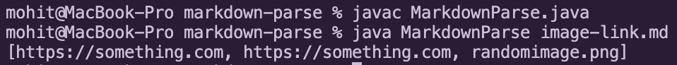

 [Home](https://molit123.github.io/cse15l-lab-reports/){: .btn .btn-green }
# Lab Report #2 - Week 4

## 1) Omitting Image Links

* The first code change my group worked on was creating the ability to distinguish between image links and website links, and making sure that the image links weren't included in the final ArrayList. We added the following code: 

    

* Here is the link for the test file:
 [Image Link Test File](https://github.com/molit123/markdown-parse/edit/main/image-link.md)

* Here is a screenshot of the faulty output in the terminal: 

    

* The bug in the code was that I wasn't checking for the `!` before the open-bracket to distinguish between a regular link and an image link. This caused the code to append all links to the Array List. In the test file, the third line was an image link and since the code didn't check for the exclamation mark, `random.png` was added to the Array List.

* **SOLUTION:** To fix this, I added a condition that checks the character before the open bracket. If this character is equal to an exclamation mark, then I omit adding the substring to the Array List and skip to the next iteration in the while loop.

## 2) Regular Text vs Links

* Another bug my group encountered and fixed was not being able to distinguish between regular text and an actual link. For example, if I have `[Random text](hello world)`, then I wouldn't want the `hello world` to be added to the Array List. The following shows what we added to fix this:

    

* Here is the link for the `no-links.md` test file: 
[No Links Test File](https://github.com/molit123/markdown-parse/edit/main/no-links.md)

* Here is a screenshot of the faulty output in the terminal:

    

* In the original code, we never added any distinction between regular text and links (we simply added what was between the parentheses to the Array List). This caused regular text to show up in the output as seen above, when an empty Array List should have been returned.

* **SOLUTION:** To fix this bug, I needed to add some sort of distinction between regular text and links. I decided to check if there were any spaces in the subtring since links never contain spaces. If the substring contained a space then I omit adding the substring to the Array List and skip to the next iteration in the while loop. 

## 3) No Parentheses No Substring

* Another issue in the code was that we were never checking for whether or not there were actually parentheses in the markdown file. Since `indexOf("(")` returns `-1` if there is no instance of it within the file, we would get an IndexOutOfBoundsException when creating a substring of the values between the parentheses. Here is the code we added to fix this edge case: 

    

* Here is the link for the `bracket-file.md` test file: [Bracket File Link](https://github.com/molit123/markdown-parse/edit/main/bracket-file.md)

* Here is a screenshot of the error message in the terminal: 

    

* In the original code, there was no condition that checked if the parentheses even existed before creating the substring of the markdown file. When we tried creating this substring, an IndexOutOfBoundsException was thrown since `-1` is not a valid index. In the test file, I have regular text inserted between two regular brackets, not parentheses. Therefore, this file also checks that regular text is not added to the Array List.

*  **SOLUTION:** To fix this bug, I added a condition before creating the substring that checks whether `openParen` and `closeParen` are equal to -1. If so, then I increment `currentIndex` and skip to the next iteration in the while loop.