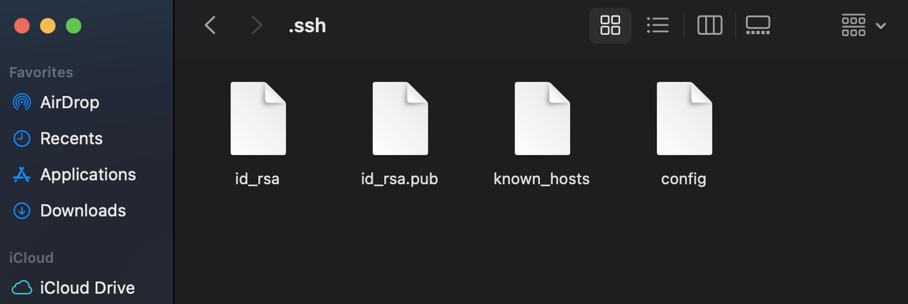
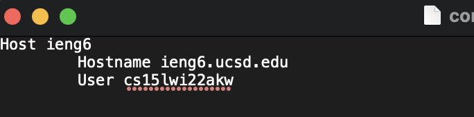
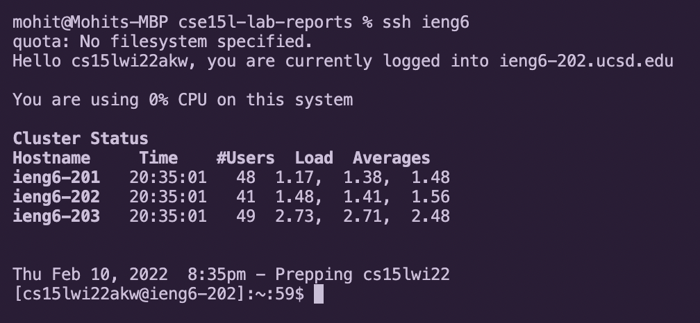
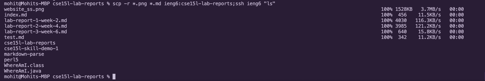

# Lab Report #3 - Week 6

## Streamlining `ssh` Configuration

* Since logging in with `ssh` can become tedious, here is my documentation of streamlining the process.

* I began by creating a file named `config` within my .ssh folder: 

    
    
* I typed the following into the config file. The text that follows `Host` is the alias that I chose. The file also contains the hostname and username for logging into ieng6.

    

* Here is a screenshot of using the alias to login to the ieng6 network:

    

* Below is a screenshot of copying over the `.png` and `.md` files of my `cse15l-lab-reports` repository over to ieng6 using the `scp -r` command with the alias I created. Additionally, I logged into ieng6 after and called the `ls` command:

    