# Lab Report #4

* Here are the links for my markdown parse repository as well as the one my group reviewed:
    * [My Repository](https://github.com/molit123/markdown-parse)
    * [Reviewed Repository](https://github.com/yi113/markdown-parse) 

* I will be testing 3 cases across both implementations of Markdown Parse. I have added the required tests within the test file of each implementation.

## Test Snippet #1

* For the first snippet, MarkdownParse should produce an ArrayList of `{"google.com", "google.com", "ucsd.edu"}`

* Here are the results for testing the snippet on **my** version of MarkdownParse: 

    * This is the code for the test: 

        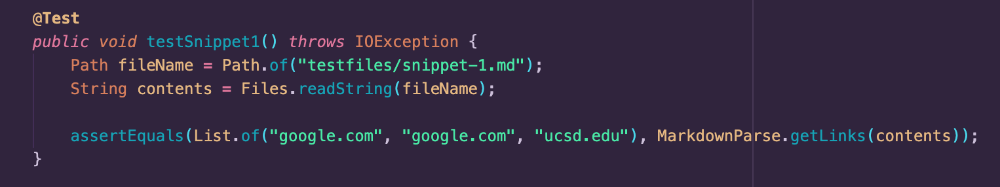

    * This is the output after running the test: 

        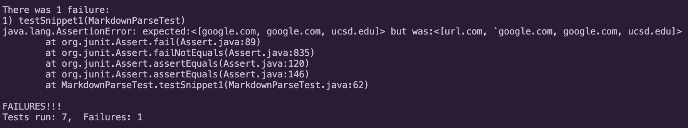

* Here are the results for testing the snippet on the **reviewed** repository: 

    * This is the code for the test: 

        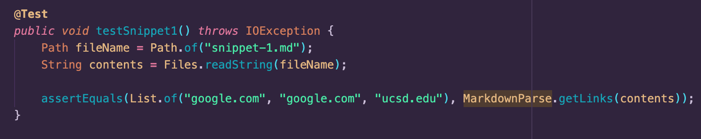

    * This is the output after running the test: 

        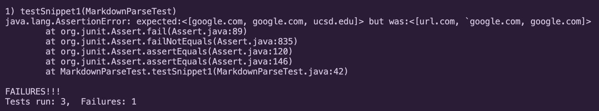

## Test Snippet #2

* For the second snippet, MarkdownParse should produce an ArrayList of `{"a.com", "a.com", "example.com"}`

* Here are the results for testing the snippet on **my** version of MarkdownParse:

    * This is the code for the test: 

        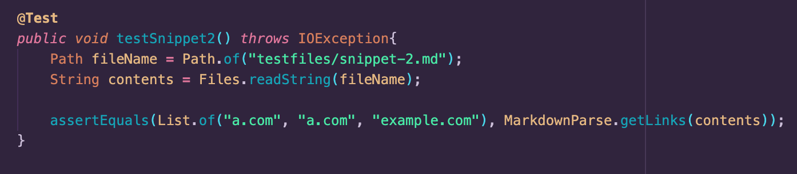

    * This is the output after running the test: 

        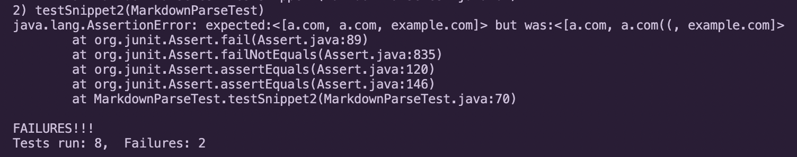

* Here are the results for testing the snippet on the **reviewed** repository: 

    * This is the code for the test: 

        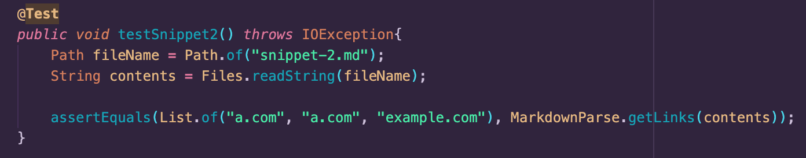

    * This is the output after running the test: 

        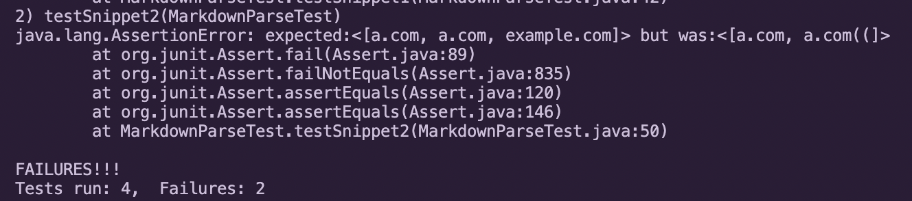

## Test Snippet #3

* For the third snippet, MarkdownParse should produce an ArrayList of `{"https://cse.ucsd.edu/"}`

* Here are the results for testing the snippet on **my** version of MarkdownParse:

    * This is the code for the test: 

        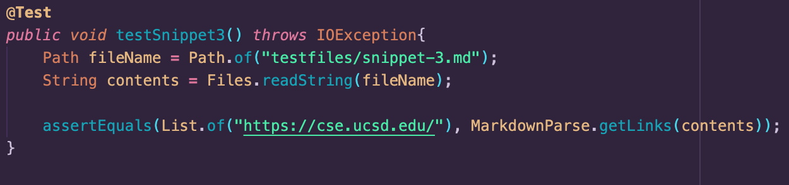

    * This is the output after running the test: 

        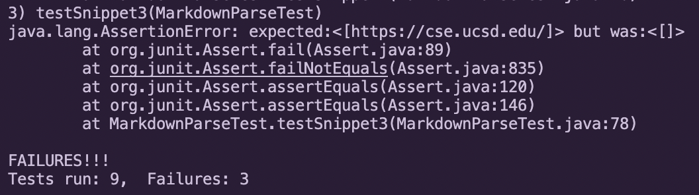

* Here are the results for testing the snippet on the **reviewed** repository: 

    * This is the code for the test: 

        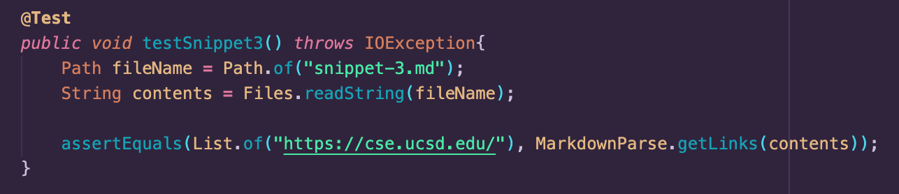

    * This is the output after running the test: 

        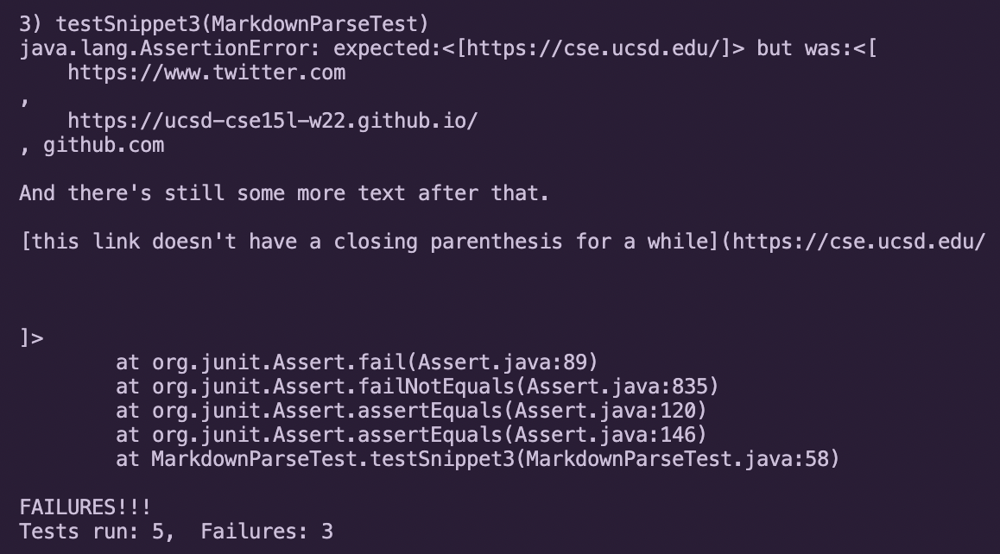

## Possible Fixes for My Version

* For snippet #1, I would need to add a condition that checks whether the text within the brackets contains any backticks. If so, then it should skip that iteration of the loop and disregard the link that follows the brackets. Additionally, I would need to format the actual links and remove any backticks within the parentheses.

* For snippet #2, I would need to do the same as stated above, and format the links before adding them to the ArrayList. In this case, I would need to parse for any additional parentheses or brackets within the text and remove those before appending the link.

* For snippet #3, my code recognized the entire space after the link and before the close parentheses as part of the link and thus excluded it from the ArrayList. To fix this, I would need to add a condition that distinguishes between space characters within the link and after it. This would remove invalid links from the ArrayList while still appending them in cases such as this snippet.